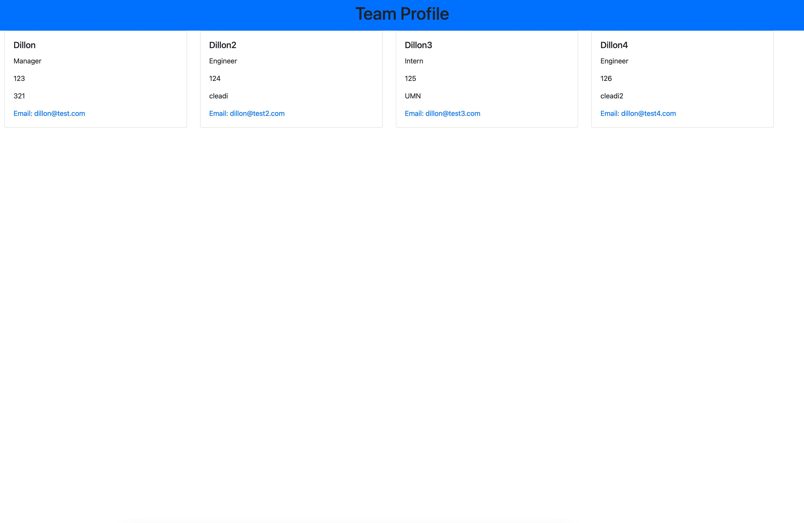

# Team Profile Generator
Boot Camp HW #8

## Project Description
- User is able to create a simple website that will display each member of the team from a list of three choices: manager, engineer, or intern.
- To use this application, you will need to clone this application to your local machine and run node index.js in a terminal window that's pointed to the root folder. You will also need to make sure you've installed the required dependencies listed in the package.json file.
- You will then be presented with some prompts, which you can use to build your team.

## Application Walkthrough Video
- https://watch.screencastify.com/v/1f5u5QtjFvZy9s0cIzvh

## Screenshot

## Website Link (GitHub Repository)
https://github.com/cleadi/team-profile-generator